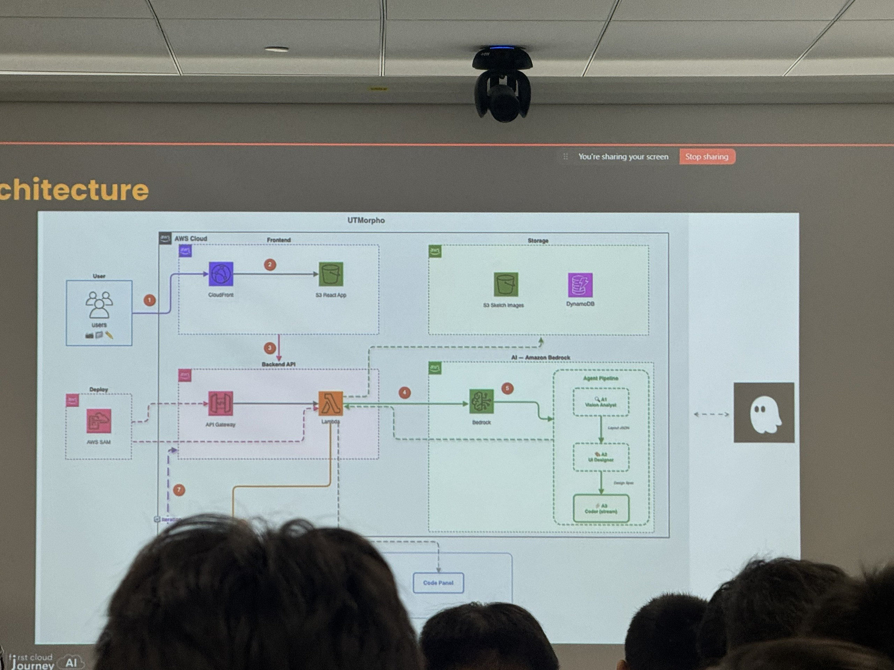
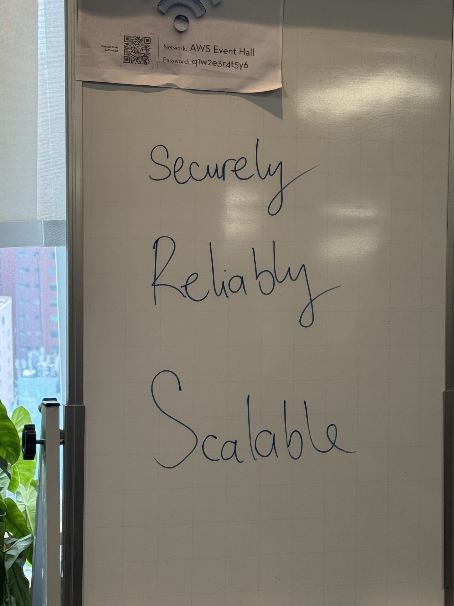

# Báo cáo tóm tắt: FCAJ Community Day

### Thông tin sự kiện

&emsp;**Tên sự kiện:** FCAJ Community Day

&emsp;**Thời gian:** 9:00 SA – 12:00 CH, Thứ Bảy, ngày 23 tháng 5 năm 2026

&emsp;**Địa điểm:** Tòa nhà Bitexco Financial Tower, Tầng 26, 2 Đường Hải Triều, Sài Gòn, Thành phố Hồ Chí Minh

&emsp;**Vai trò:** Người tham dự

---

### Lịch trình sự kiện

| Thời gian | Phiên trình bày | Diễn giả |
|---|---|---|
| 8:30 – 9:00 SA | Ổn định chỗ ngồi tại Tầng 26 | — |
| 9:00 – 9:30 SA | Context Is Everything: Making AI Actually Work for You | Tinh Truong |
| 9:30 – 9:45 SA | Friendly AI Assistant with Amazon QuickSight Q | Anh Pham |
| 9:45 – 10:25 SA | From Edge To Origin: CloudFront as Your Foundation | Thinh Nguyen |
| 10:25 – 10:55 SA | 36 hrs with LotusHacks – Building UTMorpho from Idea to Reality | Team VIB |
| 10:55 – 11:00 SA | Giải lao | — |
| 11:00 – 11:30 SA | Non-Determinism of "Deterministic" LLM Settings | Duc Dao |
| 11:30 – 12:00 CH | Enterprise-Grade Multi-Agent System: The Case of Startup Credit Scoring | Vy Lam |

---

### Nội dung nổi bật từng phiên

#### Context Is Everything: Making AI Actually Work for You — *Tinh Truong*
- Vì sao AI thất bại khi thiếu context & "context" thực sự có nghĩa là gì
- Từ prompt đến bộ nhớ: AI đang tiến hóa như thế nào (khái niệm Second AI Brain)
- Context tốt hơn → kết quả tốt hơn (tư duy thực tiễn & mẹo áp dụng)
- Định hướng nghề nghiệp & cách sinh viên bắt đầu xây dựng với AI + Q&A

#### Friendly AI Assistant with Amazon QuickSight Q — *Anh Pham*
- **Quick Chat Agent**: Trợ lý AI để khám phá dữ liệu và phân tích insight
- **Quick Flows**: Tạo workflow thông minh bằng ngôn ngữ tự nhiên — không cần code
- **Quick Spaces**: Không gian cộng tác giúp biến insight cá nhân thành tri thức đội nhóm
- **Quick Sight**: Xây dựng dashboard và báo cáo từ dữ liệu thô bằng ngôn ngữ tự nhiên

#### From Edge To Origin: CloudFront as Your Foundation — *Thinh Nguyen*
- Amazon CloudFront cho mọi loại workload
- Tối ưu chi phí với Amazon CloudFront
- Các tính năng bảo mật
- Tăng cường độ tin cậy và hiệu suất với Amazon CloudFront

#### 36 hrs with LotusHacks – Building UTMorpho from Idea to Reality — *Team VIB*
- Lý do nhóm tham gia LotusHacks
- Từ con số 0 đến ý tưởng — Hành trình brainstorming
- Xác định vấn đề & định hình sản phẩm UTMorpho
- Xây dựng sản phẩm dưới áp lực — Sprint 36 giờ liên tục
- Thách thức, thất bại & điểm ngoặt
- UTMorpho — Tổng quan sản phẩm & Demo
- Bài học rút ra & bước tiếp theo

#### Non-Determinism of "Deterministic" LLM Settings — *Duc Dao*
- LLM chọn token tiếp theo như thế nào
- Giả định: Temperature=0 đảm bảo tính tất định
- Thực tế: Các tối ưu hóa inference nói ngược lại
- Tác động thực tế & các chiến lược giảm thiểu rủi ro

#### Enterprise-Grade Multi-Agent System: The Case of Startup Credit Scoring — *Vy Lam*
- Sự không tương thích cấu trúc giữa hệ thống ngân hàng và dữ liệu startup
- Single Agent: Khi nào nên dùng và khi nào không
- Mô hình Multi-Agent
- Thiết kế Ủy ban tín dụng ảo (Virtual Credit Committee)
- Guardrails & Tuân thủ quy định
- ROI vận hành & Lộ trình triển khai

---

### Bài học rút ra

- **Context với AI là tất cả**: Chất lượng đầu ra của AI tỉ lệ thuận trực tiếp với chất lượng context đầu vào. Xây dựng cách tiếp cận có cấu trúc theo kiểu "Second Brain" là kỹ năng quan trọng khi làm việc hiệu quả với AI.
- **Amazon QuickSight Q** mang ngôn ngữ tự nhiên vào phân tích dữ liệu, cho phép người dùng không biết code vẫn có thể tạo insight — một bước tiến lớn trong việc dân chủ hóa dữ liệu.
- **CloudFront không chỉ là CDN**: Nó có thể đóng vai trò là lớp bảo mật, công cụ tối ưu chi phí và nền tảng hiệu suất cho mọi loại workload, không chỉ riêng file tĩnh.
- **Tư duy hackathon**: Câu chuyện sprint 36 giờ của team UTMorpho cho thấy tư duy có cấu trúc (xác định vấn đề → MVP → lặp lại) dưới áp lực vẫn có thể cho ra sản phẩm hoạt động được. Thất bại và xoay trục là một phần tất yếu.
- **LLM không tất định ngay cả khi Temperature=0**: Xử lý song song phần cứng và tính không xác định của phép tính số thực có nghĩa là thiết lập "tất định" chỉ là xấp xỉ hữu ích, không phải đảm bảo tuyệt đối. Các hệ thống cần tái tạo kết quả chính xác cần có thêm chiến lược giảm thiểu rủi ro.
- **Hệ thống multi-agent cho tuân thủ**: Mô hình "Ủy ban tín dụng ảo" với các agent chuyên biệt và guardrails cho thấy AI có thể được áp dụng một cách có trách nhiệm trong các lĩnh vực tài chính có độ rủi ro cao.

### Cảm nhận cá nhân

Tham dự FCAJ Community Day là một trải nghiệm thực sự truyền cảm hứng. Được gặp gỡ trực tiếp các practitioner AWS, builder và các bạn thực tập sinh khác — ngay tại tòa nhà Bitexco mang tính biểu tượng — khiến sự kiện trở nên rất ý nghĩa và đáng nhớ.

Điều ấn tượng nhất là sự đa dạng của các phiên trình bày: từ tư duy nền tảng về AI và hạ tầng cloud, đến câu chuyện hackathon thực tế và kiến trúc multi-agent tiên tiến. Mỗi phiên cho mình một góc nhìn khác nhau về cloud và AI.

Bài nói về **tính không tất định của LLM** đặc biệt mở ra cách nhìn mới cho mình — nhắc nhở rằng những giả định trong phần mềm (như "thiết lập tất định = đầu ra tất định") thường sụp đổ ở quy mô lớn hoặc dưới áp lực tối ưu hóa.

Nhìn chung, sự kiện này củng cố thêm động lực để mình tiếp tục xây dựng trên AWS và duy trì kết nối với cộng đồng FCJ đang ngày càng phát triển.

#### Hình ảnh sự kiện

