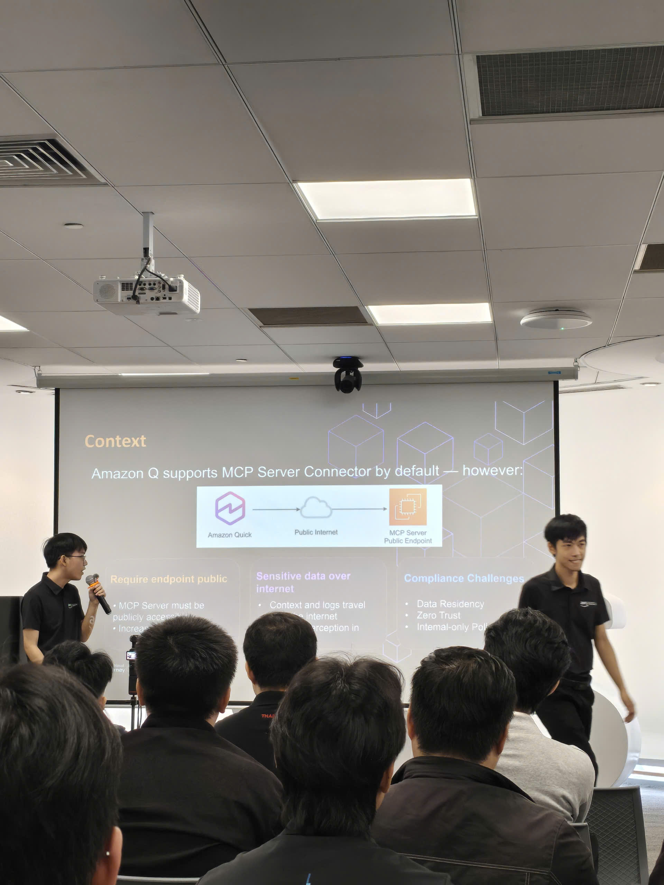
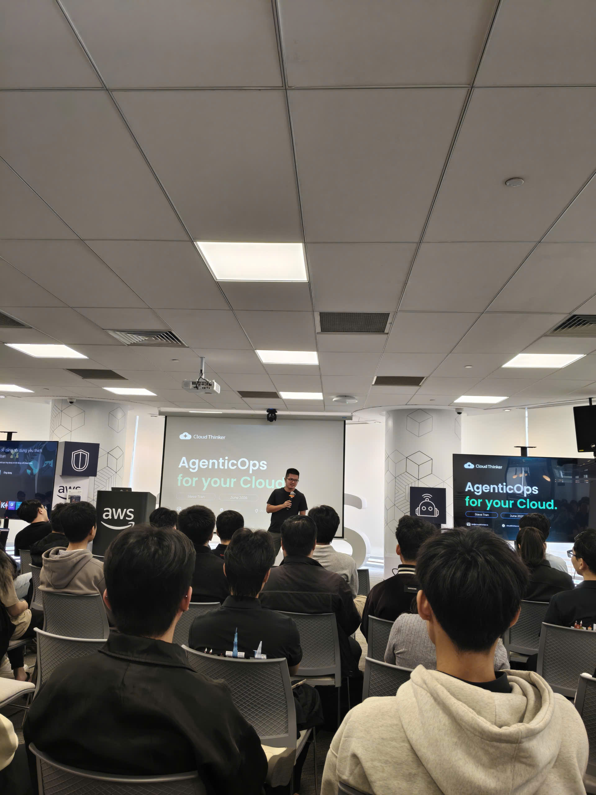

# Báo cáo tóm tắt: FCAJ Community Day — Phiên Tháng 6

### Thông tin sự kiện

&emsp;**Tên sự kiện:** FCAJ Community Day

&emsp;**Thời gian:** 9:00 SA – 12:00 CH, Thứ Bảy, ngày 27 tháng 6 năm 2026

&emsp;**Địa điểm:** Tòa nhà Bitexco Financial Tower, Amazon Q Conference Room (Tầng 26), 2 Đường Hải Triều, Sài Gòn, Thành phố Hồ Chí Minh

&emsp;**Vé:** Amazon Q Conference Room (Tầng 26)

&emsp;**Vai trò:** Người tham dự

---

### Lịch trình sự kiện

| Thời gian | Phiên trình bày | Diễn giả |
|---|---|---|
| 8:30 – 9:00 SA | Ổn định chỗ ngồi | — |
| 9:00 – 9:25 SA | Deep Response Engine: From Detection to Autonomous Resolution | — |
| 9:25 – 9:55 SA | Voice Agents: Building Human-Like AI Conversations at Scale | — |
| 9:55 – 10:20 SA | AWS DevOps Agent: Your Always-Available Operations Teammate | — |
| 10:20 – 10:45 SA | AI-Powered Productivity: Workforce Planning For Enterprise | — |
| 10:45 – 11:30 SA | Building Secure Private MCP Connection with Amazon Q | — |

---

### Nội dung nổi bật từng phiên

#### Deep Response Engine: From Detection to Autonomous Resolution
- Bức tường phức tạp trong vận hành cloud hiện đại
- Chuyển dịch từ hệ thống hướng cảnh báo sang hệ thống hướng hành động
- Tổng quan kiến trúc Deep Response Engine
- Demo trực tiếp quy trình xử lý sự cố tự động
- Tác động kinh doanh: giảm chi phí và vận hành zero-downtime

#### Voice Agents: Building Human-Like AI Conversations at Scale
- Sự tiến hóa từ IVR và chatbot sang AI voice agent
- Các thách thức chính: độ trễ, độ chính xác và tương tác tự nhiên
- Amazon Nova Sonic và foundation model speech-to-speech
- Kiến trúc: telephony, streaming, Bedrock, MCP tools
- Use case doanh nghiệp, best practice và demo trực tiếp

#### AWS DevOps Agent: Your Always-Available Operations Teammate
- Tổng quan về AWS DevOps Agent
- Giảm MTTD và MTTR với vận hành dựa trên AI
- Hỗ trợ môi trường multi-cloud và hybrid
- Bedrock AgentCore và phương pháp lý luận multi-agent
- Use case thực tế và demo ECS walkthrough

#### AI-Powered Productivity: Workforce Planning For Enterprise
- Thách thức chuyển đổi HR trong doanh nghiệp hiện đại
- Tổng quan Amazon Q và các tính năng HR của nó
- Tăng tốc vận hành HR bằng tự động hóa
- Phân tích lực lượng lao động và insight dựa trên dữ liệu
- Lập kế hoạch lực lượng lao động chiến lược cho quyết định doanh nghiệp

#### Building Secure Private MCP Connection with Amazon Q
- Giới thiệu Amazon Q như một nền tảng trợ lý AI
- MCP (Model Context Protocol) và vai trò mở rộng khả năng
- Thách thức bảo mật trong tích hợp dựa trên MCP
- Cấu hình kết nối private VPC cho Amazon Q
- Demo và insight triển khai thực tế

---

### Bài học rút ra

- **Từ phản ứng đến tự động**: Phiên Deep Response Engine thách thức mô hình tư duy của mình về vận hành cloud — thay vì chỉ phát hiện và cảnh báo, các hệ thống hiện đại đang tiến tới tự động khắc phục. Điều này trực tiếp liên quan đến dự án DMS, nơi giám sát chủ động và tự phục hồi sẽ giảm bớt gánh nặng vận hành.
- **Voice AI đang trưởng thành nhanh chóng**: Kiến trúc speech-to-speech của Amazon Nova Sonic loại bỏ độ trễ pipeline ASR → NLU → TTS truyền thống. Với các use case doanh nghiệp như dịch vụ khách hàng, điều này giảm đáng kể ma sát khi tương tác.
- **AI-driven DevOps giảm MTTD/MTTR**: Phiên AWS DevOps Agent cho thấy AI có thể liên tục giám sát hệ thống qua môi trường multi-cloud và đề xuất hoặc thậm chí thực thi các bản sửa lỗi — thay đổi đáng kể cho vận hành on-call.
- **Amazon Q cho HR**: Thấy AI được áp dụng vào lập kế hoạch lực lượng lao động (không chỉ phát triển phần mềm) là điều mở ra nhiều suy nghĩ mới. Phiên này cho thấy cách tiếp cận trợ lý dựa trên LLM có thể tổng quát hóa sang nhiều lĩnh vực kinh doanh khác nhau.
- **Bảo mật MCP là vấn đề quan trọng**: Phiên kết nối private MCP làm nổi bật rằng khi trợ lý AI có quyền truy cập vào nhiều dữ liệu và công cụ hơn qua MCP, việc bảo mật những kết nối đó (kết nối private VPC, xác thực, phân quyền phạm vi) trở nên cực kỳ quan trọng — đặc biệt trong môi trường doanh nghiệp.

### Cảm nhận cá nhân

Phiên tháng 6 của FCAJ Community Day cảm giác còn tập trung hơn so với phiên tháng 5 — cả năm phiên đều xoay quanh **AI agentic và vận hành AI**, tạo ra một chủ đề rất mạch lạc cho cả buổi sáng.

Điều ấn tượng nhất là sự tiến triển từ các công cụ AI đơn lẻ sang **hệ thống multi-agent**: Deep Response Engine, AWS DevOps Agent và các phiên MCP đều chỉ về cùng một hướng — AI đang chuyển dịch từ hỗ trợ sang tự động, và hạ tầng để hỗ trợ điều đó (Bedrock AgentCore, MCP, kết nối VPC) đang trưởng thành rất nhanh.

Việc được ngồi trong **Amazon Q Conference Room** mang tên chính sản phẩm đang được trình bày cũng tạo thêm một chút thú vị cho trải nghiệm. Các phiên mang tính kỹ thuật cao và nhiều demo trực tiếp, điều mình rất đánh giá cao với tư cách là người đang tích cực xây dựng trên AWS.

Nhìn chung, sự kiện này củng cố thêm rằng những kỹ năng mình đang phát triển trong kỳ thực tập này — serverless, IAM, Lambda, DynamoDB — chính là những thành phần nền tảng mà các hệ thống AI agentic được xây dựng trên đó.

#### Hình ảnh sự kiện

