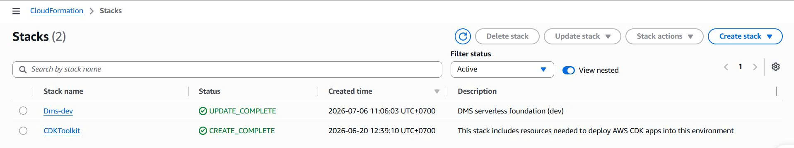
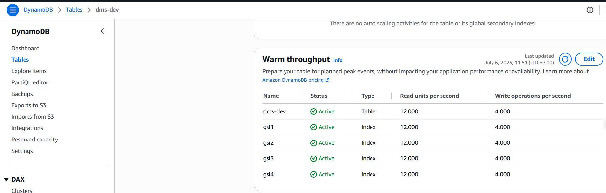
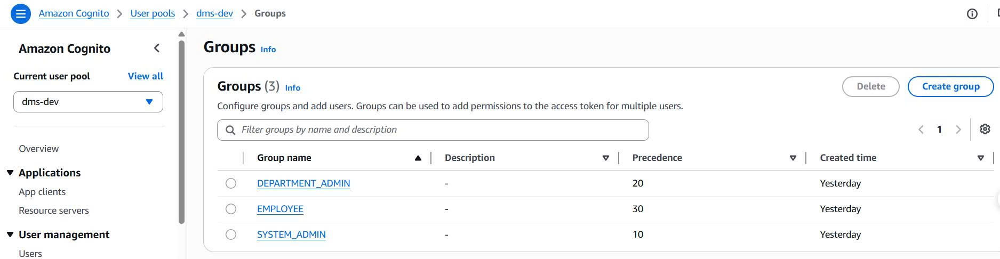

Bước này triển khai toàn bộ hạ tầng DMS lên AWS bằng một lệnh CDK duy nhất. CDK stack sẽ tự động tạo tất cả các dịch vụ cần thiết.

#### Những gì sẽ được tạo ra

`DmsStack` tạo ra các tài nguyên theo thứ tự sau:

**1. Amazon Cognito — User Pool**
- Tên pool: `dms-dev`
- Đăng nhập bằng email, tắt tự đăng ký
- 3 nhóm người dùng: `EMPLOYEE` (ưu tiên 30), `DEPARTMENT_ADMIN` (ưu tiên 20), `SYSTEM_ADMIN` (ưu tiên 10)
- Chính sách mật khẩu: tối thiểu 12 ký tự, yêu cầu số, chữ hoa, chữ thường và ký tự đặc biệt
- Hiệu lực token: Access/ID token = 60 phút, Refresh token = 7 ngày

**2. Amazon S3 — Ba bucket private**
- `FrontendBucket` — lưu trữ React SPA đã build
- `QuarantineBucket` — nhận tất cả file upload trước; GuardDuty quét tại đây
- `DocumentsBucket` — chỉ lưu các tài liệu sạch, đã được duyệt
- Tất cả bucket chặn public access; CORS cấu hình trên QuarantineBucket cho thao tác PUT

**3. Amazon DynamoDB — Single Table**
- Tên bảng: `dms-dev`
- Billing: PAY_PER_REQUEST (không cần lên kế hoạch capacity)
- Mã hóa: AWS_MANAGED
- Point-In-Time Recovery (PITR): bật
- Thuộc tính TTL: `expiresAtEpoch` (tự xóa bản ghi UploadIntent hết hạn)
- 4 Global Secondary Index (GSI1–GSI4) cho các query pattern khác nhau

**4. AWS Lambda — 11 Functions (Node.js 22, ARM64)**

| Handler | Chức năng |
|---|---|
| `me` | Lấy thông tin người dùng hiện tại |
| `documents` | Liệt kê tài liệu theo user/phòng ban |
| `document-detail` | Lấy chi tiết một tài liệu kèm danh sách version |
| `document-audit-events` | Lấy audit log của một tài liệu |
| `upload-intents` | Tạo Presigned PUT URL lên QuarantineBucket |
| `download-intents` | Tạo Presigned GET URL từ DocumentsBucket |
| `document-sharing` | Chia sẻ/thu hồi quyền truy cập tài liệu |
| `admin-users` | Tạo/quản lý người dùng trong Cognito |
| `analytics` | Thống kê dung lượng và hoạt động |
| `process-upload` | SQS consumer: chuyển file sạch, ghi DynamoDB |
| `process-upload-dlq` | Xử lý message upload thất bại từ Dead Letter Queue |

**5. Amazon SQS — Upload Queue**
- Queue chính: visibility timeout 6 phút, lưu 4 ngày
- Dead Letter Queue: lưu 14 ngày, kích hoạt sau 10 lần nhận thất bại
- S3 QuarantineBucket kích hoạt SQS mỗi khi có `s3:ObjectCreated:Put` dưới prefix `quarantine/`

**6. GuardDuty Malware Protection Plan**
- IAM role riêng cấp quyền cho GuardDuty quét QuarantineBucket
- File được gắn tag `CLEAN` hoặc `THREAT_FOUND` sau khi quét xong

**7. Amazon API Gateway — REST API**
- Cognito Authorizer xác thực JWT trên tất cả route được bảo vệ
- Route ánh xạ tới Lambda function theo HTTP method và path

**8. Amazon CloudFront — CDN cho Frontend**
- Phân phối React SPA từ `FrontendBucket` qua CloudFront OAC

**9. CloudWatch + SNS Alerts**
- Log group lưu 2 tuần (dev) hoặc 3 tháng (production)
- SNS topic gửi email cảnh báo khi chi phí bất thường hoặc Lambda lỗi

#### Lệnh Deploy

Di chuyển vào thư mục infrastructure và chạy:

```bash
cd aws/infrastructure
npm install
npx cdk deploy -c environment=dev -c alertEmail=your-email@example.com
```

Hoặc dùng biến môi trường:
```bash
DMS_ALERT_EMAIL=your-email@example.com npx cdk deploy -c environment=dev
```

#### Kiểm tra sau khi Deploy

Sau khi `cdk deploy` hoàn thành, kiểm tra phần **Outputs** trong terminal. Bạn sẽ thấy:
- `UserPoolId` — ID của Cognito User Pool
- `UserPoolClientId` — ID của Cognito App Client
- `ApiUrl` — Endpoint URL của API Gateway
- `CloudFrontUrl` — URL truy cập frontend

Kiểm tra thêm trên **AWS Console**:
1. **CloudFormation** → Stack `DmsStack-dev` → Status: `CREATE_COMPLETE`
   
2. **DynamoDB** → Bảng `dms-dev` tồn tại với 4 GSI
   
3. **S3** → 3 bucket đã được tạo
4. **Lambda** → 11 function hiển thị
5. **Cognito** → User pool `dms-dev` có 3 nhóm
   