Sau khi hạ tầng được triển khai, bước này hướng dẫn tạo người dùng đầu tiên, tải lên tài liệu và xác minh toàn bộ luồng hoạt động end-to-end.

#### 1. Tạo người dùng Admin đầu tiên

Vì `selfSignUpEnabled: false`, tất cả người dùng phải được tạo bởi quản trị viên.

Vào **AWS Console → Cognito → User Pools → `dms-dev` → Users → Create user**:
- **Email**: `admin@yourcompany.com`
- **Temporary password**: Đặt một mật khẩu mạnh (sẽ thay đổi khi đăng nhập lần đầu)
- Sau khi tạo, vào tab **Groups** và thêm người dùng vào nhóm `SYSTEM_ADMIN`

Hoặc dùng AWS CLI:
```bash
aws cognito-idp admin-create-user \
  --user-pool-id <UserPoolId> \
  --username admin@yourcompany.com \
  --temporary-password "Temp@12345!" \
  --user-attributes Name=email,Value=admin@yourcompany.com Name=email_verified,Value=true Name=name,Value="Admin User"

aws cognito-idp admin-add-user-to-group \
  --user-pool-id <UserPoolId> \
  --username admin@yourcompany.com \
  --group-name SYSTEM_ADMIN
```

#### 2. Xác thực và lấy JWT Token

Dùng flow `USER_PASSWORD_AUTH` của Cognito để lấy access token:

```bash
aws cognito-idp initiate-auth \
  --auth-flow USER_PASSWORD_AUTH \
  --client-id <UserPoolClientId> \
  --auth-parameters USERNAME=admin@yourcompany.com,PASSWORD="YourNewPassword"
```

Sao chép `AccessToken` từ kết quả trả về. Token này sẽ dùng như Bearer token trong mọi lời gọi API.

#### 3. Kiểm thử endpoint `/me`

```bash
curl -H "Authorization: Bearer <AccessToken>" \
  https://<ApiUrl>/me
```

Kết quả mong đợi:
```json
{
  "userId": "...",
  "email": "admin@yourcompany.com",
  "name": "Admin User",
  "groups": ["SYSTEM_ADMIN"]
}
```

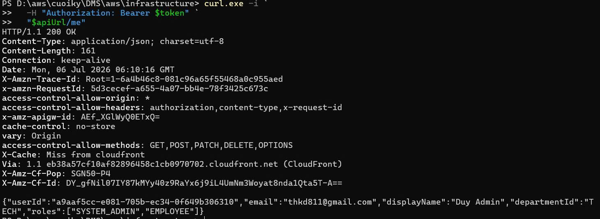

#### 4. Tải lên tài liệu (toàn bộ luồng)

**Bước 4a — Yêu cầu Presigned Upload URL:**
```bash
curl -X POST \
  -H "Authorization: Bearer <AccessToken>" \
  -H "Content-Type: application/json" \
  -d '{"filename": "report.pdf", "contentType": "application/pdf", "size": 102400}' \
  https://<ApiUrl>/upload-intents
```

Kết quả trả về:
```json
{
  "uploadIntentId": "ui-xxxx",
  "presignedUrl": "https://s3.amazonaws.com/quarantine-bucket/quarantine/...",
  "expiresAt": "2026-07-03T14:00:00Z"
}
```

**Bước 4b — Upload thẳng lên S3 bằng Presigned URL:**
```bash
curl -X PUT \
  -H "Content-Type: application/pdf" \
  --data-binary @report.pdf \
  "<presignedUrl>"
```

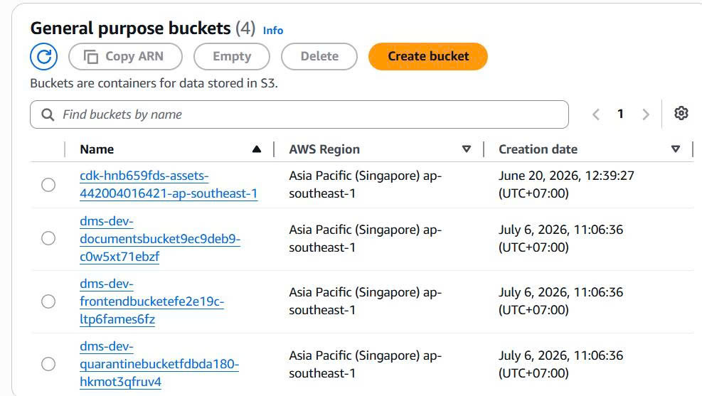

**Bước 4c — Xác minh pipeline đã chạy tự động:**
1. Vào **S3 → QuarantineBucket** → xác nhận file đã xuất hiện
2. Vào **GuardDuty → Malware Protection** → xác nhận việc quét đã chạy và gắn tag cho file
3. Vào **S3 → DocumentsBucket** → file sạch sẽ xuất hiện sau khoảng ~30 giây
   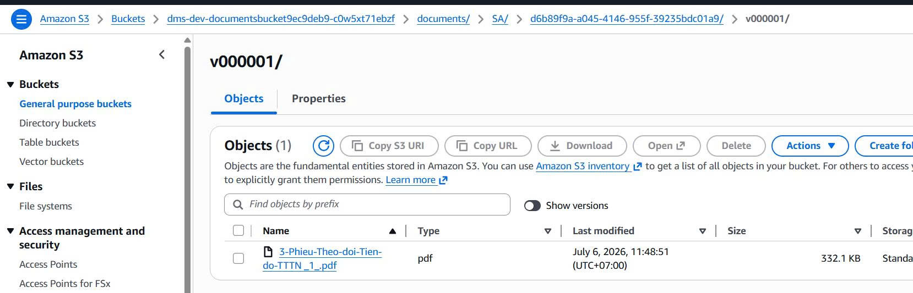
4. Vào **DynamoDB → `dms-dev`** → kiểm tra bản ghi `DOC#...` mới

#### 5. Liệt kê tài liệu

```bash
curl -H "Authorization: Bearer <AccessToken>" \
  https://<ApiUrl>/documents
```

Bạn sẽ thấy tài liệu vừa tải lên trong kết quả với `documentId`, `filename`, `versionNumber` và timestamp.

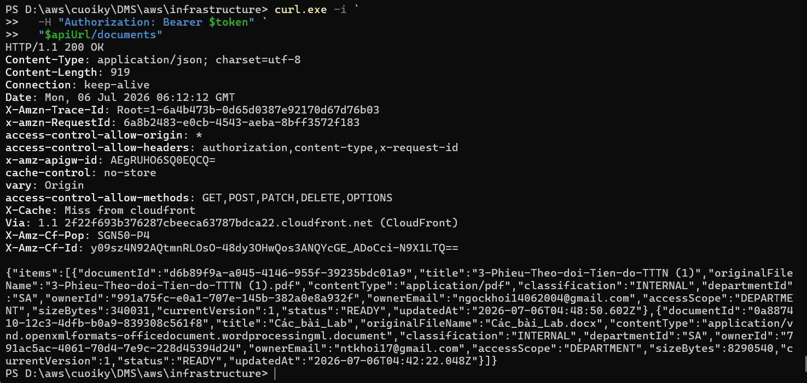

#### 6. Chạy Frontend trên máy local

```bash
cd frontend
npm install
npm run dev
```

Mở `http://localhost:5173` trên trình duyệt. Nhập `UserPoolId`, `UserPoolClientId` và `ApiUrl` từ output của CDK để cấu hình app, sau đó đăng nhập bằng tài khoản admin.

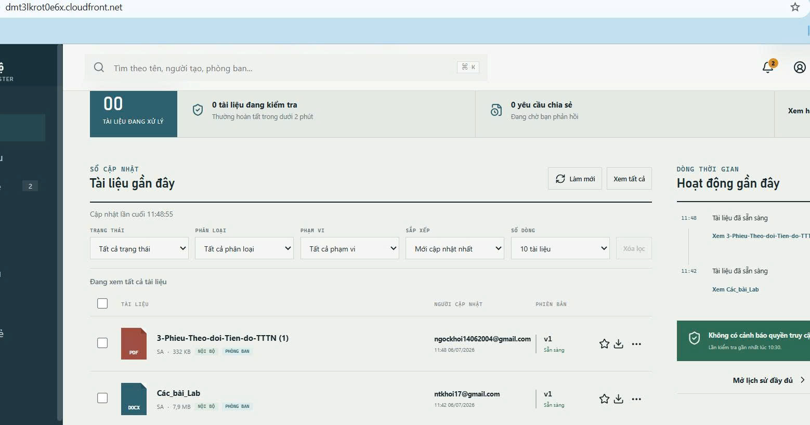

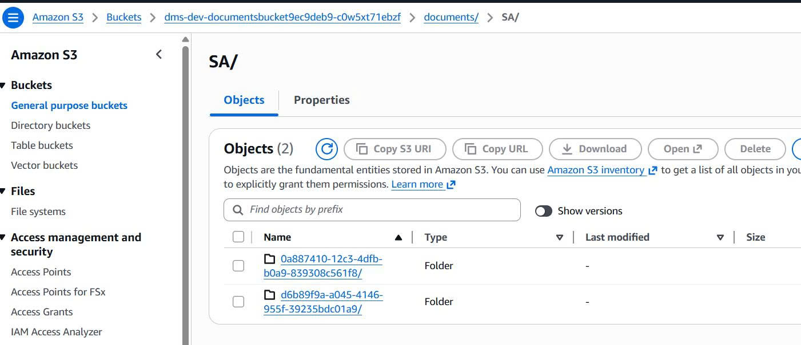

#### 7. Khám phá các tính năng trên Frontend

Sau khi đăng nhập, bạn có thể kiểm thử các tính năng của giao diện React SPA:

**Tải xuống tài liệu:**
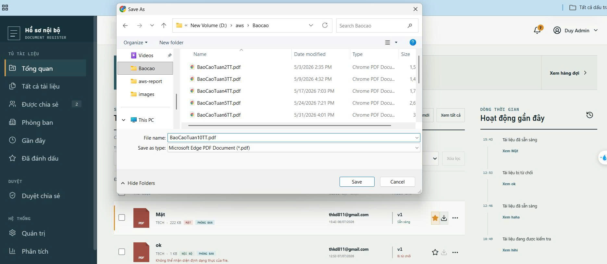

**Chia sẻ tài liệu:**
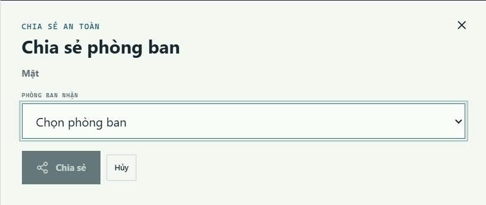
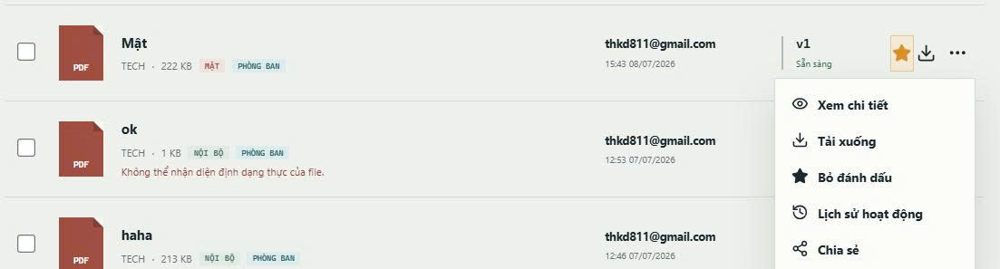
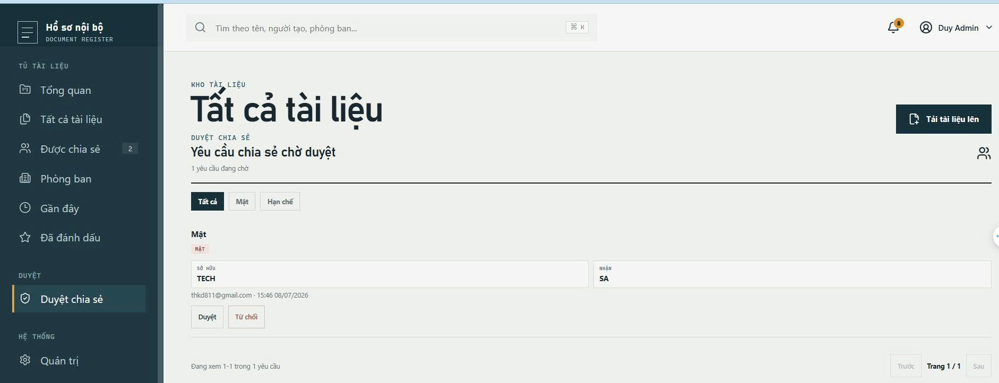

**Quản lý người dùng (Dành cho System Admin):**
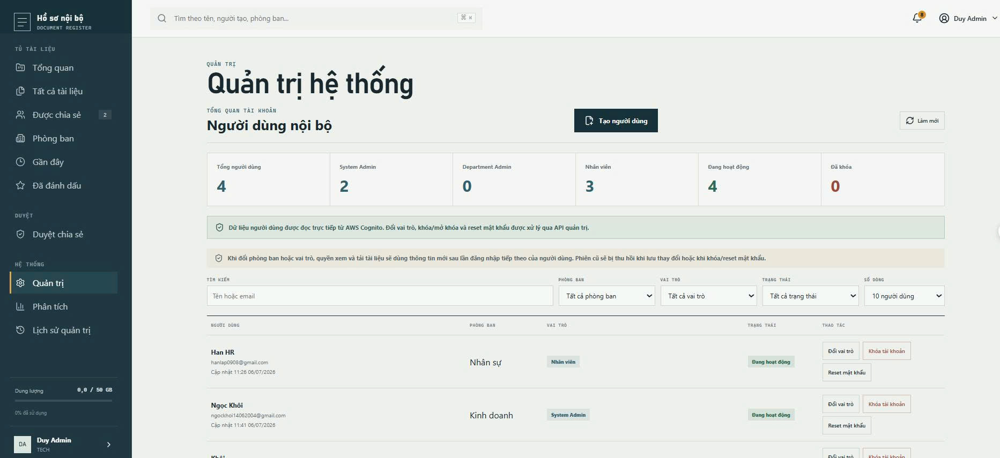

**Quản lý phòng ban (Dành cho Department Admin):**
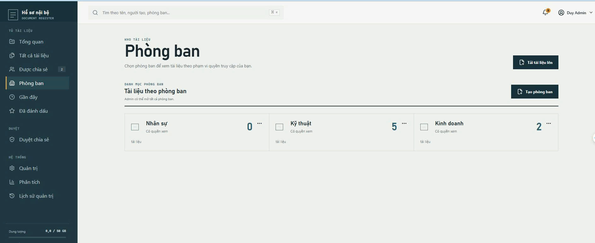

**Nhật ký hoạt động & Lịch sử quản trị:**
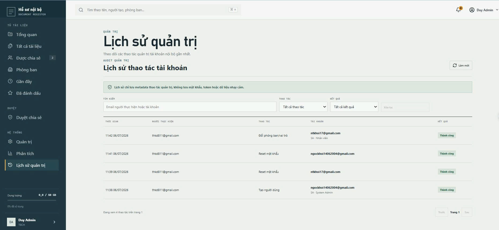

**Dashboard Phân tích:**
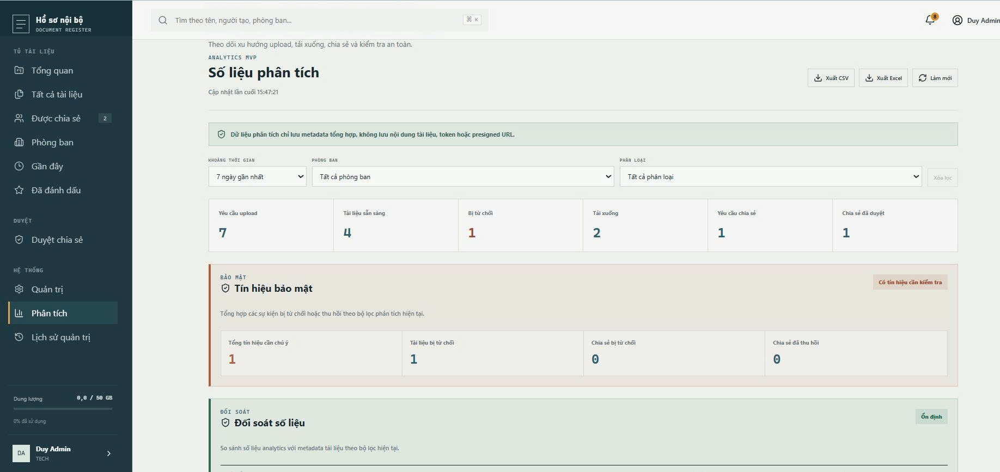
